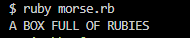

# Decode-a-Morse
> In this project we are writing a Ruby code to decode a Morse message. We use terminal to run and test output of our code.



## Built With

- **Ruby**

## Getting Started

### Steps to run the project

#### 1 - Install Ruby.

#### 2 - Clone the repository.
```
git clone https://github.com/iAmWaris97/Decode-a-Morse.git
```

#### 3 - run the project
Inside the morse.rb file there is a method decode_message:
> Pass your morse code as a parameter in this method like so: decode_message('.- -... --- -..- ..-. ..- .-.. .-.. --- ..-. .-. ..- -... .. . ...')

## Authors
### 👩‍💻 Alaa Shaheen

- GitHub: [@AlaaShaheen2](https://github.com/AlaaShaheen2)
- Twitter: [@Alaa Shaheen](https://twitter.com/AlaaShaheen93)
- LinkedIn: [@Alaa Shaheen](https://www.linkedin.com/in/alaa-shaheen-879140240/)

### 👨‍💻 Mulugeta M.

- GitHub: [@belmeetmule](https://github.com/belmeetmule)
- Twitter: [@belmeetmule](https://twitter.com/belmeetmule)
- LinkedIn: [belmeetmule](https://linkedin.com/in/belmeetmule)

### 👨‍💻 Waris Haleem

- GitHub: [@iAmWaris97](https://github.com/iAmWaris97)
- Twitter: [@iAmWaris97](https://twitter.com/iAmWaris97)
- LinkedIn: [Waris Haleem](https://www.linkedin.com/in/waris-haleem/)

## Acknowledgments

> Thanks to all the developers whose code, documentations, and efforts helped us doing this project.

## 🤝 Contributing

Contributions, issues, and feature requests are welcome!

Feel free to check the [issues page](../../issues/).

## Show your support

Please give a ⭐️ if you like this project!

## 📝 License
- This project is [MIT](./LICENSE) licensed.